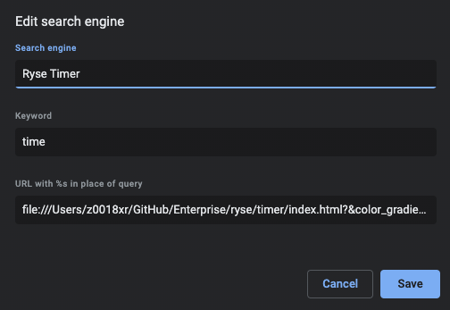
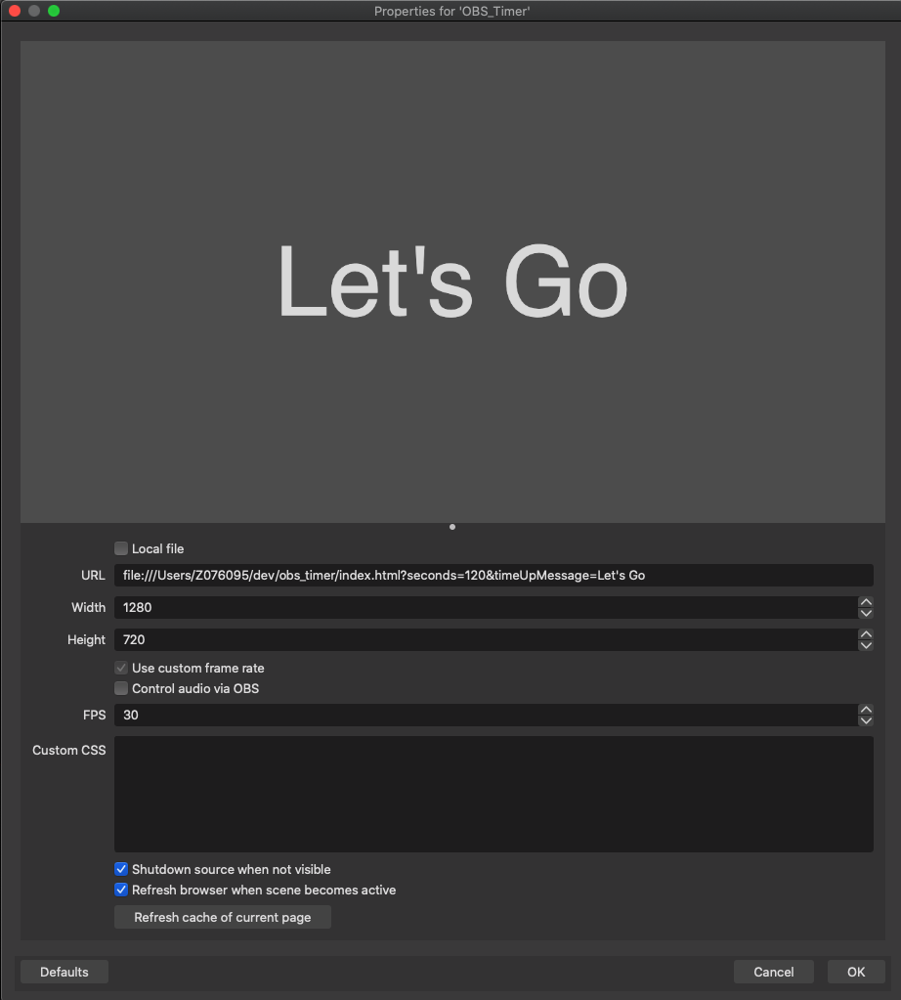

# Ryse Timer
Use this timer to quickly show a countdown timer to people as part of a Zoom or other video conferencing meeting.


# How to use
Given this is a simple HTML webpage, it's pretty flexible in usage patterns. You can clone this repo and use it as a local file or you can try using the Git Pages version at https://pages.git.target.com/ryse/timer/ (go/timer)

## Timer Configuration
All configuration is done as either [URL parameters](https://support.google.com/google-ads/answer/6277564?hl=en#) or [localStorage](https://stackoverflow.com/a/9404841/14283439) with the former overriding the latter. Here are a list of the current supported parameters.

| Parameter | Description | Default | Storage
| - | - | - | - |
| `seconds` | Duration of timer in seconds. This is overriden by the `d` param.  | `60` | ❌ |
| `d` | Duration of timer in `1h 5m 36s` format. This is overriden by the `t` param |  | ❌ |
| `t` | End time for the timer in `1:15pm` format. | | ❌ |
| `style` | Style of timer background. Supports `static` and `gradient` | `gradient` | ❌ |
| `color_static` | For static style, the background color of the timer. | `#00FF7F` | ✅ |
| `color_gradient_100` | For gradient style, the background color of the timer at 100% time remaining. | `#00FF7F` | ✅ |
| `color_gradient_75` | For gradient style, the background color of the timer at 75% time remaining. | `#3BCA6D` | ✅ |
| `color_gradient_50` | For gradient style, the background color of the timer at 50% time remaining. | `#77945C` | ✅ |
| `color_gradient_25` | For gradient style, the background color of the timer at 25% time remaining. | `#B25F4A` | ✅ |
| `color_gradient_0` | For gradient style, the background color of the timer at 0% time remaining. | `#ED2938` | ✅ |
| `color_bg` | The color behind the timer. | `transparent` | ✅ |
| `color_font` | The color of the time font. | `#FFFFFF` | ✅ |
| `color_font_shadow` | The outline color of the time font. | `#000000` | ✅ |
| `time_up_message` | The message that appears after the duration expires. | `Time's Up!` | ✅ |

## As a Browser Search Engine
For Chrome, if you navigate to [Chrome Settings/Search Engines](chrome://settings/searchEngines) you can add a new search engine to point at a local file along with URL params.



**Example URL w/ Custom Params**
```
file:///Users/z0018xr/GitHub/Enterprise/ryse/timer/index.html?color_font=rgba(255,255,255,0.8)&duration=%s
```

## As part of OBS

1. Add a Browser Source for your OBS Scene
2. Configure your desireable number of seconds, and message to display once time is up in the query string as follow.  Note that refresh cache will also reload the page, effectively resetting the timer.
**IMPORTANT - Leave the local option uncheck, otherwise querystring will be trimmed off**

```JavaScript
file:///Users/Z07609/GitHub/ryse/timer/index.html?seconds=120&timeUpMessage=Let's Go
```


